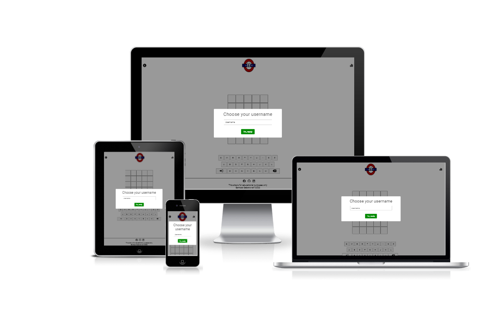
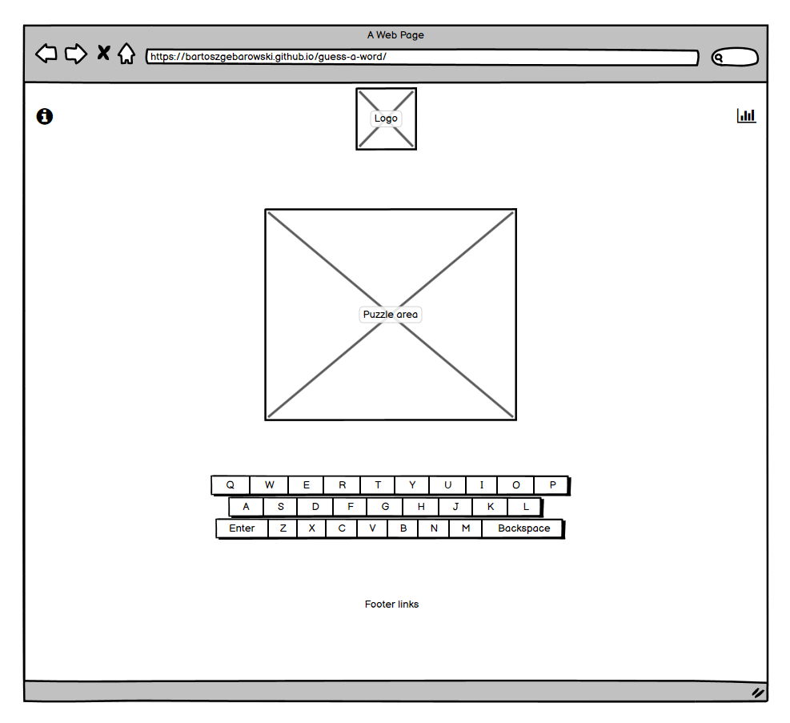
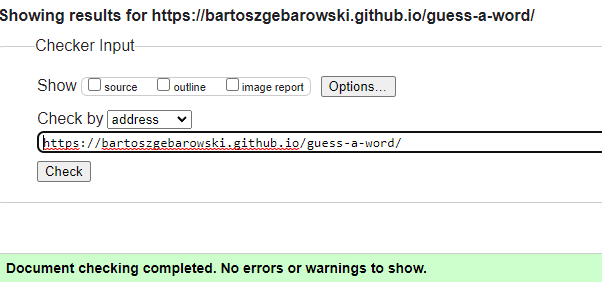
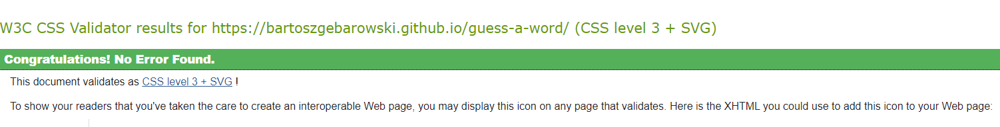

# Site overview

Word puzzles are a popular game form designed for players of all ages. There are many different genres with different rules, but the main principle always revolves around guessing the right word.
Since the concept's inception, those games where players can challenge their language skills are popular even nowadays. With the advent of new technologies, many of these games have highly successful web counterparts, and people eagerly replaced their pen and paper with mouse and keyboard. The phenomenon of the Wordle game and the massive rise of its competitors in early 2022 show an enormous demand for this type of virtual entertainment, where people can play a relatively simple game whenever and wherever they want.

This project was heavily inspired by the previously mentioned Wordle and was built as a simplified but accessible and fun alternative.

## Table of contests

1. [Site overview](#site-overview)
1. [Features](#features)
    * [Favicon](#favicon)
    * [Responsive navigation bar](#responsive-navigation-bar)
    * [Logo](#logo)
    * [Rules](#rules)
    * [Statistics](#statistics)
    * [Username creator](#username-creator)
    * [Puzzle area](#puzzle-area)
    * [Keyboard panel](#keyboard-panel)
    * [Footer](#footer)
1. [Existing features](#existing-features)
1. [Features left to implement](#features-left-to-implement)
1. [Design](#design)
    * [Colour scheme](#colour-scheme)
    * [Wireframes](#wireframes)
1. [Technologies and tools](#technologies-and-tools)
1. [Testing](#testing)
    * [Responsiveness](#responsiveness)
    * [Accessibility](#accessibility)
    * [Lighthouse testing](#lighthouse-testing)
1. [Functional testing](#functional-testing)
    * [Username input testing](#username-input-testing)
    * [Game testing](#game-testing)
    * [Alerts testing](#alerts-testing)
    * [Footer links](#footer-links)
1. [Validator testing](#validator-testing)
    * [W3C html validation service](#w3c-html-validation-service)
    * [W3C css validation service](#w3c-css-validation-service)
    * [JSHint](#jshint)
1. [Deployment](#deployment)
    * [Version control](#version-control)
    * [Deployment to Github pages](#deployment-to-github-pages)
    * [Clone the repository locally](#clone-the-repository-locally) 
1. [Credits](#credits)
    * [Honorable mentions](#honorable-mentions)
    * [Media](#media)

## Features

### Favicon

Allows a user to easily identify the page if they have multiple open tabs

### Responsive navigation bar

- It contains the logo and buttons that will bring up the rules and statistics popups respectively
  - The display of the navigation bar changes depending on screen size

### Logo 

Its purpose is to serve marketing purposes and differentiation between localized versions of the application in the future

### Rules

- It explains to user how to play a game
  - SweetAlert2 was used to present the information
  - A theme icon from the 'Font Awesome' is present as an additional form of indication and visual stimulation

### Statistics

- It displays sorted information about points and game time
  - SweetAlert2 was used to present the data in the form of a dynamic built table
  - A theme icon from the 'Font Awesome' is present as an additional form of indication and visual stimulation
  - Hover indicator informs the user that it is an interactive element

### Username creator

- Users have to create username in order to play the game
  - It is connected to the point and time tracking system
  - A validation system was implemented: blank inputs or more than 12 characters are not accepted
  - SweetAlert2 was used to present the input window

### Puzzle area

- Main area of the application
  - It contains six rows, with five tiles each
  - Each tile can contain only one letter
  - Each row symbolizes one trying to guess the right word
  - Each tile changes its colour after confirming the answer
    - If the letter is in the right place and in the word, tile will change its colour to green
    - If the letter is not in the right place but in the word, tile will change its colour to yellow
  - A validation system was implemented:
    - It is not possible to confirm empty answer or less than five characters
    - It is not possible to send more than five characters
    - The user input must be a valid English word

### Keyboard panel

- Its main purpose is to allow the user to interact with the game board
  - It simulates a real keyboard with a standard QWERTY layout
  - Buttons will change colour to red to clue users that the letters that they have guessed are not in the word
- Backspace button that allows user to remove one letter from a potential answer
- Enter button, for confirming the answer

### Footer

- It serves as quick access to various points of interests and informs that the website was created for educational purposes only
- A theme icons from the 'Font Awesome' are present as an additional form of indication and visual stimulation
- The hover effect for each icon informs the user that it is an interactive element. It is also related to a specific third-party service

[Back to Table of contents](#table-of-contests)

## Existing features

- Responsive design
- Ability to create a username
- Huge words database (over 9000 words)
- Each puzzle word is chosen randomly to ensure the replayability value
- Score and time tracking system
- Easy to port to different languages

## Features left to implement

- Fully-fledged account system
- Different difficulty settings
- Theme selector to offer a choice of graphical style
- Better statistics with real database
- Cookie policy and GDPR statement to comply with legal condition

[Back to Table of contents](#table-of-contests)

## Design

### Colour scheme

The choice of the appropriate colour was dictated by the following factors:

- Is it related to a specific brand so that the user expects a particular correlation between an element and the colour?
- Are the interactive and non-interactive elements distinguished consistently?
- Is colour scheme in line with the WCAG 2.0 contrast standard?

Default white background was chosen to ensure that the user would not be distracted by unnecessary visual stimulation while trying to solve the puzzle.

Connections to website subjects or connotations to specific brands were checked by performing meticulous web research. If such resources were not available, the Firefox colour selector tool was used instead.

Certain compromises had to be made in colour choices while using SweetAlert2.

To ensure compliance with WCAG 2.0 standard, the Contrast-Grid tool was used, which can be found at the link below:

https://contrast-grid.eightshapes.com/

[Back to Table of contents](#table-of-contests)

### Wireframes

  * Dekstop wireframe

  

  * Mobile wireframe

  

## Technologies and tools

- HTML
  - The structure of the website.
- CSS
  - Content styling
- Javascript
  - Game logic
- Visual Studio Code
  - The website was written in Visual Studio Code IDE
- GitHub
  - Source code hosting and deployment
- Git
  - Version control and pushing changes to the repository
- Fontawesome
  - Icons, as a visual representation of the intended use of the elements throughout the site
- SweetAlert2
  - Popup boxes
- Google fonts
  - Roboto font, used to present content
- Gimp
  - Scaling images and converting them to modern web formats
- FavIcon generator http://tools.dynamicdrive.com/favicon/
  - Favicon
- Balsamiq
  - Creation of wireframes
- Free Dictionary API https://dictionaryapi.dev/
  - words database
- Contrast grid https://contrast-grid.eightshapes.com/
  - Colour palette compliance with WCAG 2.0 standard

[Back to Table of contents](#table-of-contests)

## Testing

### Responsiveness

All pages were tested to support screen sizes from 320px and upwards.

Steps to test:

1. Open the browser and navigate to [Guess a word](https://bartoszgebarowski.github.io/guess-a-word/)
1. Open the developer tools
1. Set to dimensions to responsive
1. Set the zoom to 50%
1. Click the grey bar on the left to change the width

Expected:

The website supports declared screen sizes

Result:

The website is behaving as expected

- Website was also opened on the following mobile devices:

Samsung Galaxy S7

### Accessibility

Wave Evaluation Tool was used throughout the development process and for final testing. The following tests were conducted:

- Webpage structure implementation test
- HTML lang attribute test
- Contrast errors test
- Aria labels implementation test
- Alt attribute implementation test
- SweetAlert2 popup boxes tests, where certain compromises had to be made

### Lighthouse testing

[Back to Table of contents](#table-of-contests)

## Functional testing

### Username input testing

_Scenario 1: Correct input_

1. Navigate to [Woord page](https://bartoszgebarowski.github.io/guess-a-word/)
2. Input the following data:
   John
3. Click I'm ready button

Expected:

A player can start the game

Result:

The alert is behaving as expected

_Scenario 2: No username_

1. Navigate to [Woord page](https://bartoszgebarowski.github.io/guess-a-word/)
2. Leave the username input intentionally blank
3. Click I'm ready button

Expected:

A player cannot start the game and a warning is displayed

Result:

The alert is behaving as expected

_Scenario 3: Username input is longer than 12 characters_

1. Navigate to [Woord page](https://bartoszgebarowski.github.io/guess-a-word/)
2. Input the following data:
   myusernameisj
3. Click I'm ready button

Expected:

A player cannot start the game and a warning is displayed

Result:

The alert is behaving as expected

_Scenario 4: Username tries to escape the alert_

1. Navigate to [Woord page](https://bartoszgebarowski.github.io/guess-a-word/)
2. Click anywhere besides the confirm button or press Escape button

Expected:

A player cannot exit the alert

Result:

The alert is behaving as expected

[Back to Table of contents](#table-of-contests)

### Game testing

_Scenario 1: User tries to confirm a valid word and his guess is correct_

1. Navigate to [Woord page](https://bartoszgebarowski.github.io/guess-a-word/)
2. Click the letter buttons to create a word
3. Press Enter button to confirm the answer

Expected:

1. User input is evaluated
2. Game board is cleared
3. Alert is displayed

Result:

The application is behaving as expected

_Scenario 2: User tries to confirm a valid word and his guess is incorrect_

1. Navigate to [Woord page](https://bartoszgebarowski.github.io/guess-a-word/)
2. Click the letter buttons to create a word
3. Press Enter button to confirm the answer

Expected:

1. User input is evaluated on each row
2. The tiles on the board and the keyboard panel are coloured according to the user input
3. Alert is displayed
4. User can try to guess the right word in the next row

Result:

The application is behaving as expected

_Scenario 3: User exhausted all tries_

1. Navigate to [Woord page](https://bartoszgebarowski.github.io/guess-a-word/)
2. Click the letter buttons to create a word, and then press enter to confirm your answer
3. Repeat step 2, six times, to exhaust all tries

Expected:

1. User input is evaluated on each row
2. Game board is cleared
3. Alert is displayed

Result:

The application is behaving as expected

_Scenario 5: User tries to confirm invalid English world_

1. Navigate to [Woord page](https://bartoszgebarowski.github.io/guess-a-word/)
2. Click the letter buttons to create a word LLLLL
3. Press Enter button to confirm the answer

Expected :

Alert is displayed that informs the user that the guessed word is not a valid English word

Result:

The application is behaving as expected

_Scenario 6: User tries to confirm word shorter than 5 letters_

1. Navigate to [Woord page](https://bartoszgebarowski.github.io/guess-a-word/)
2. Click the letter buttons to create a word LLLL
3. Press Enter button to confirm the answer

Expected :

An alert is displayed that informs the user that the input is invalid

Result:

The application is behaving as expected

_Scenario 7: User tries to insert more than five letters_

1. Navigate to [Woord page](https://bartoszgebarowski.github.io/guess-a-word/)
2. Click the letter buttons to create a word LLLLLL

Expected :

An alert is displayed notifying the user that he has tried to enter an additional letter

Result:

The application is behaving as expected

[Back to Table of contents](#table-of-contests)

### Alerts testing

_Scenario 1: User presses the confirm button_

1. Navigate to [Woord page](https://bartoszgebarowski.github.io/guess-a-word/)
2. Click either button in the navigation bar, marked by Font Awesome theme icon

Expected:

Popup with game rules or statistics data is displayed

Result:

The alerts are behaving as expected

_Scenario 2: Username tries to escape the alert_

1. Navigate to [Woord page](https://bartoszgebarowski.github.io/guess-a-word/)
2. Click either button in the navigation bar, marked by Font Awesome theme icon
3. Click anywhere besides the confirm button or press Escape button

Expected:

A player cannot exit the alerts

Result:

The alerts are behaving as expected

[Back to Table of contents](#table-of-contests)

### Footer links

Manual testing was performed to ensure that each button leads to the external website/application and it opens in a new tab

| Navigation Link | Page to load                                      |
| --------------- | ------------------------------------------------- |
| Facebook        | https://www.facebook.com/                         |
| Github          | https://github.com/bartoszgebarowski/guess-a-word |
| Linkedin        | https://www.linkedin.com/in/bartoszgebarowski/    |

[Back to Table of contents](#table-of-contests)

### Validator testing

#### W3C HTML Validation Service

#### W3C CSS Validation Service

### JSHint

Code passed through JSHint with no significant issues.

[Back to Table of contents](#table-of-contests)

## Deployment

### Version Control

The website was created in Virtual Studio Code editor, and changes were pushed to the GitHub repository https://github.com/bartoszgebarowski/guess-a-word by using bash terminal.

The following commands were used:

`git status` - This command was used to check files staged and not staged for commit

`git add <file.extension>` - This command was used to add changes in file/files, with particular names and extensions, to be staged for commit

`git add .` - This command was used to add changes in all files, regardless of name and extension, to be staged for commit

`git commit -m "commit message"` - This command was used to commit all staged changes to a local repository

`git push` - This command was used to upload all committed locally changes to a GitHub repository

[Back to Table of contents](#table-of-contents)

### Deployment to GitHub pages

The site was deployed to GitHub by taking the following steps:

- Navigating to the Settings tab
- Navigating to the Pages tab in the menu on the left
- Selecting Branch from which the site is to be built
- Clicking Save
- Receiving confirmation stating that "Your site is published at https://bartoszgebarowski.github.io/repository-name/

The live site can be found at the link below:

https://bartoszgebarowski.github.io/guess-a-word/

### Clone the Repository locally

- Click the Code button
- Navigate to the HTTPS tab
- Click the clipboard copy icon (message "Copied" should appear instead of the icon)
- Choose the IDE with git bash support
- Use command `git clone copied-url` into bash terminal

[Back to Table of contents](#table-of-contests)

## Credits

### Honorable mentions

- Gurjot Singh - Code Institute Mentor who supervised the development process and assisted me through the journey with Javascript
- Tobiasz Chodarewicz - programming wizard whose guidance and patiently explaining complicated problems allowed me to progress through this project consistently
- You - for visiting my repository and reading the documentation

### Media

Logo
  * https://www.nicepng.com/maxp/u2w7o0a9y3o0i1r5/
  * https://www.subpng.com/png-1ohhrp/

[Back to Table of contents](#table-of-contests)
